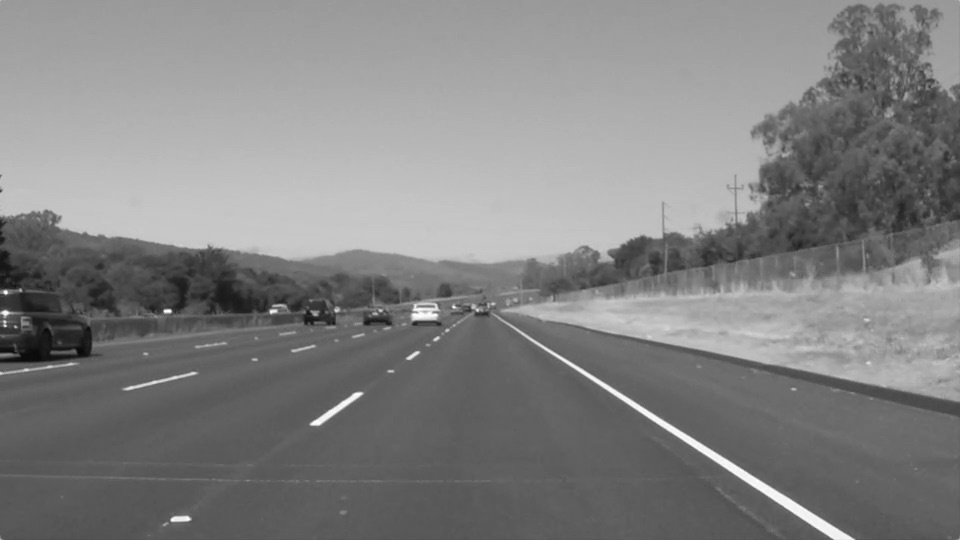
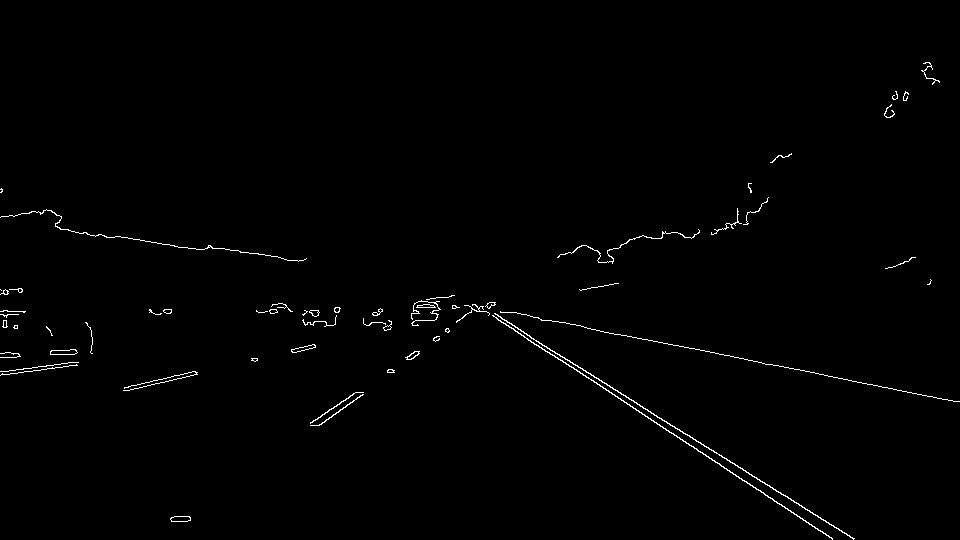
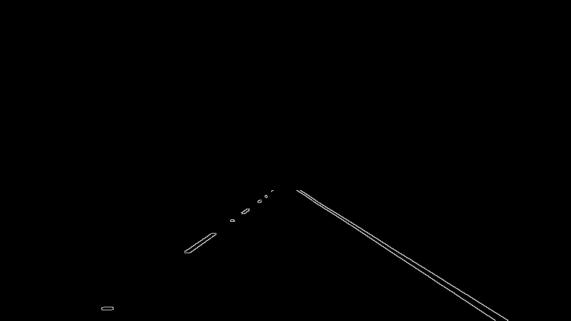
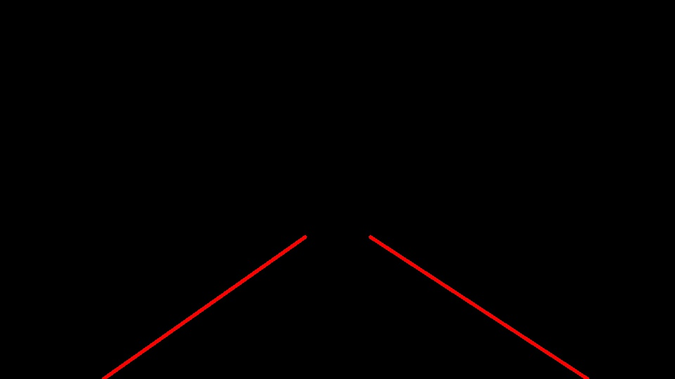
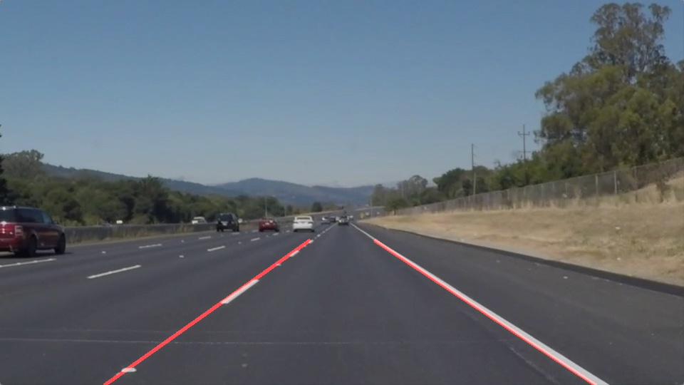

# **Finding Lane Lines on the Road** 

**Author**: Andrej Georgievski

**Date**: September 2017

## Writeup
---

**Finding Lane Lines on the Road**

The goals / steps of this project are the following:
* Make a pipeline that finds lane lines on the road
* Reflect on your work in a written report

---

### Reflection

### 1. Pipeline description

My pipeline consisted of 6 steps. 
1. First, I converted the images to grayscale.

 
Converted to black and white

2. After the grayscale conversion, I apply a gaussian blur to remove unwanted noise 
that may result in more 'edges' during the Canny edge detection step.
3. I then find edges using a Canny edge detector.

 
After the Canny edge detector

4. The image is then masked using a trapezoid shape to define a region of interest.

The masked image

5. The masked image is then processed using the Hough transform to extract the left 
and right lane lines.
    - In this step, I do all the math needed to extrapolate and draw both lines in full.

The lines are drawn

6. The final image is a combined image of the original one, overlaid with the 
lane lines drawn in the previous step. 

 
The final image / video frame.

In order to draw a single line on the left and right lanes, I added several 
helper functions for slope and linear function calculation.
I also modified the hough_lines function by adding a single argument which 
defines the horizon up to which lane lines are drawn on the screen (for a more 
consistent look overall).

The biggest modification was made in a newly-coded **findBestMatch** function, where I find 
the best-matching lines according to the lines found by the HoughLinesP method of OpenCV.
Some basic linear algebra was used in this step to determine the top and bottom points
where the lines start and end in the image. All the helper functions I mentioned 
previously were put to use here.

### 2. Potential shortcomings with the current pipeline

One potential shortcoming of the proposed pipeline is the reliance of image size parameters for it to work. 
Because we select a region of interest in the given image stream, it is possible that this pipeline is not universal 
for all videos where we should detect lines, because of the hard-coded region of interest. We might have lines just 
outside of the region, in which case the pipeline won't work, or will misbehave. 

Another shortcoming could be the way the lines are drawn, and in two ways.
Let me elaborate more thoroughly here:
- The first shortcoming from the chosen method is the reliance of fixed endpoints 
for drawing the lane lines. This shortcoming is presented right away in the challenge
video, where we can see a hood in the image. To avoid drawing over the hood of our car 
in such a video stream, we would have to enable intelligent methods for differentiating 
asphalt (or roads in general) from cars, in order to draw the lines accurately.
The worse option (in my humble opinion, that is) is to rely on the top and bottom 
points found by the probabilistic Hough Transform method to draw the lines... which 
might not give us the desired results.
- The second shortcoming is the adaptability of one such pipeline in traffic.
Everytime we identify lane lines in the region of interest, we extend them almost entirely in 
the bottom half of the image. If anything blocks our road view in that image, we might encounter additional lines 
detected by the Canny + Hough Transform filter. These might (or will) add unwanted noise to the process of proper 
lane line detection. 

### 3. Possible improvements to your pipeline

One of many improvements that we might want to do to this pipeline is to apply further 
parameter optimization to achieve overall better results.

A nice touch would be to integrate a method to memorize the detected lane lines in the previous few frames. That way, 
we could make our drawn lines output smoother by accurately 'damping' the deviations of the found lines using the 
previous frame's lane and the average slope for the lines in previous frames.

A further improvement would be to fight the unwanted noise caused by unnecessary detected objects in the region of 
interest on the road ahead, by filtering the line slopes before looking for our average slope for each line.

